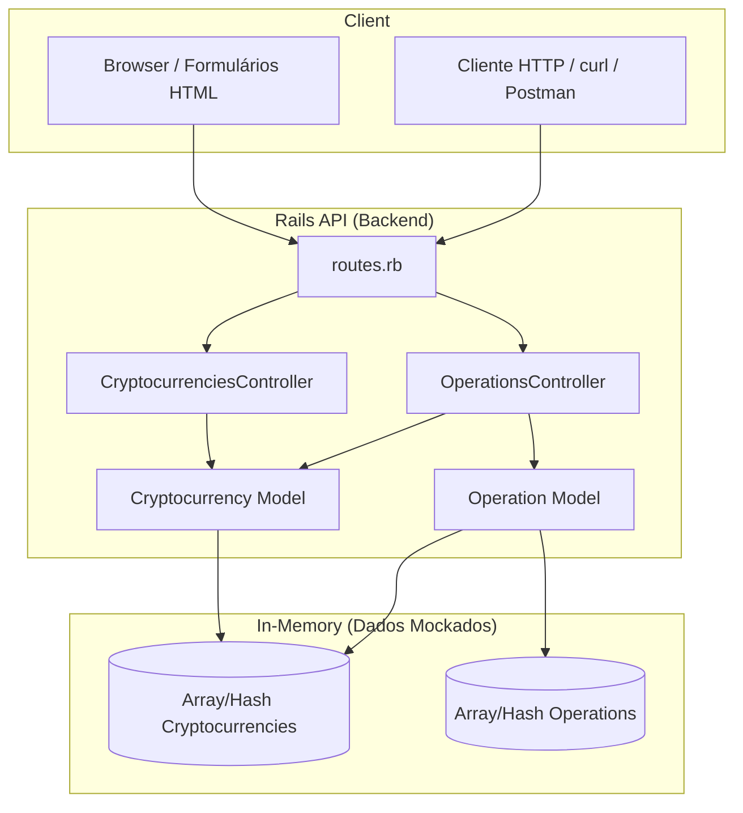

# Arquitetura do MVP — Mini Sistema de Moedas Digitais

Este documento descreve a visão geral e a arquitetura em camadas do projeto, sem uso de banco de dados.

---

## Visão Geral

O sistema é um **MVP de moedas digitais** focado em:

- CRUD de criptomoedas (ex.: Bitcoin, Solana).
- Registro de operações (compra/venda) vinculadas a uma moeda e a um preço no momento da operação.

A persistência é **em memória**: dados são mantidos em estruturas Ruby (arrays/hashes) durante a execução do servidor e são perdidos ao reiniciar.

---

## Arquitetura em Camadas

### 1. Frontend (cliente)

- **Cliente HTTP** (Postman, curl, script) para consumir a API JSON.
- **Formulários HTML simples** (opcional), servidos pelo próprio Rails, para testes manuais de POST no browser (criar moeda, criar operação).

Não há SPA nem frontend complexo no escopo do MVP.

### 2. Backend (Rails API)

- Aplicação **Rails em modo API**.
- **Controllers** recebem requisições HTTP, delegam à camada de dados em memória e devolvem JSON.
- **Models** (Cryptocurrency, Operation) encapsulam regras de negócio, validações e cálculos (ex.: custo da operação).
- Nenhuma conexão com banco de dados real nem uso de ORM de persistência.

### 3. Camada de Dados (in-memory)

- **Repositório em memória:** arrays ou hashes que armazenam instâncias de `Cryptocurrency` e `Operation`.
- Cada **POST** que cria um recurso gera um novo objeto com ID automático (sequencial) e o adiciona ao repositório.
- **GET** (listagem ou por ID) lê desses mesmos estruturas e retorna os dados em JSON.
- **PUT/PATCH** e **DELETE** alteram ou removem elementos nesses repositórios.

---

## Fluxo Resumido

1. Cliente envia **POST** (ex.: criar operação) com `cryptocurrency_id`, `operation_type`, `amount`.
2. Controller extrai params e chama a camada de modelo/repositório.
3. Model/repositório busca a moeda pelo `cryptocurrency_id`, obtém o preço atual, calcula `cost` e define `operation_date`.
4. Nova instância de `Operation` é armazenada no array/hash em memória com ID gerado automaticamente.
5. Controller faz `render json: operation, status: 201`.

O mesmo padrão se aplica a listagens (GET) e aos demais verbos REST sobre cryptocurrencies e operations.

---

## Diagrama da Arquitetura (Mermaid)

---

## Justificativa para Não Uso de Banco de Dados

- **Ambiente acadêmico e restrito:** ambiente Linux corporativo sem permissão de sudo e sem possibilidade de compilar gems nativas ou subir serviços de banco.
- **Foco do MVP:** arquitetura em camadas, desenho da API REST, fluxos de negócio e organização do código, e não persistência ou operações de banco.
- **Simplicidade:** dados em memória permitem rodar o projeto imediatamente, sem configuração de BD ou migrações.
- **Expectativa de perda de dados:** é esperado que os dados resetem ao reiniciar o servidor; isso está alinhado aos objetivos do MVP.
