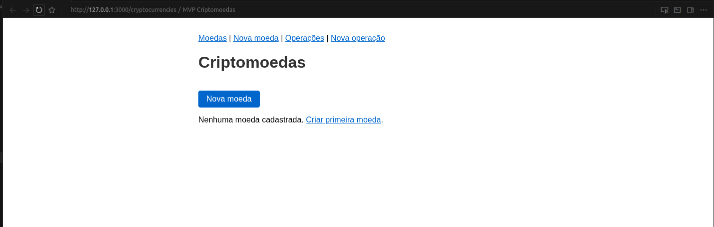

# MVP — Mini Sistema de Moedas Digitais

MVP acadêmico em **Ruby on Rails (API mode)** com dados **mockados em memória**. Sem banco de dados e sem ActiveRecord.

## Requisitos

- Ruby 3.0.2 (ver `.ruby-version`)
- Bundler

## Instalação

```bash
bundle install
```

## Execução

```bash
rails server
```

Acesse: **http://localhost:3000**



## Rotas e uso

### Criptomoedas

| Método | Rota | Descrição |
|--------|------|-----------|
| GET | `/cryptocurrencies` | Lista moedas (JSON ou HTML) |
| GET | `/cryptocurrencies/new` | Formulário para criar moeda |
| GET | `/cryptocurrencies/:id` | Detalhe de uma moeda |
| POST | `/cryptocurrencies` | Cria moeda (JSON ou form) |
| PUT/PATCH | `/cryptocurrencies/:id` | Atualiza moeda |
| DELETE | `/cryptocurrencies/:id` | Remove moeda |

### Operações

| Método | Rota | Descrição |
|--------|------|-----------|
| GET | `/operations` | Lista operações (JSON ou HTML) |
| GET | `/operations/new` | Formulário para criar operação |
| GET | `/operations/:id` | Detalhe de uma operação |
| POST | `/operations` | Cria operação (JSON ou form) |

### Testes via browser

- **Nova moeda:** http://localhost:3000/cryptocurrencies/new  
  Campos: Nome, Símbolo, Preço, Imagem (URL).
- **Nova operação:** http://localhost:3000/operations/new  
  Campos: ID da criptomoeda, Tipo (buy/sell), Quantidade.  
  O custo e a data são calculados automaticamente.

### Testes via curl (JSON)

```bash
# Criar moeda
curl -X POST http://localhost:3000/cryptocurrencies \
  -H "Content-Type: application/json" \
  -d '{"name":"Bitcoin","symbol":"BTC","price":50000,"image":""}'

# Listar moedas
curl http://localhost:3000/cryptocurrencies

# Criar operação (use o id retornado acima)
curl -X POST http://localhost:3000/operations \
  -H "Content-Type: application/json" \
  -d '{"cryptocurrency_id":1,"operation_type":"buy","amount":0.5}'
```

## Estrutura do projeto

- **Models:** `Cryptocurrency`, `Operation` (classes Ruby, sem ActiveRecord).
- **Repositórios:** `CryptocurrencyRepository`, `OperationRepository` (persistência em memória por entidade).
- **Serviços:** camada de aplicação em `app/services` (Create/Update/Destroy para cryptocurrencies, Create para operations).
- **Controllers:** delegam para serviços e repositórios; retornam JSON e, em HTML, formulários e listagens.
- **Views:** formulários em `app/views/cryptocurrencies/new.html.erb` e `app/views/operations/new.html.erb`.

Os dados são perdidos ao reiniciar o servidor (comportamento esperado do MVP).
